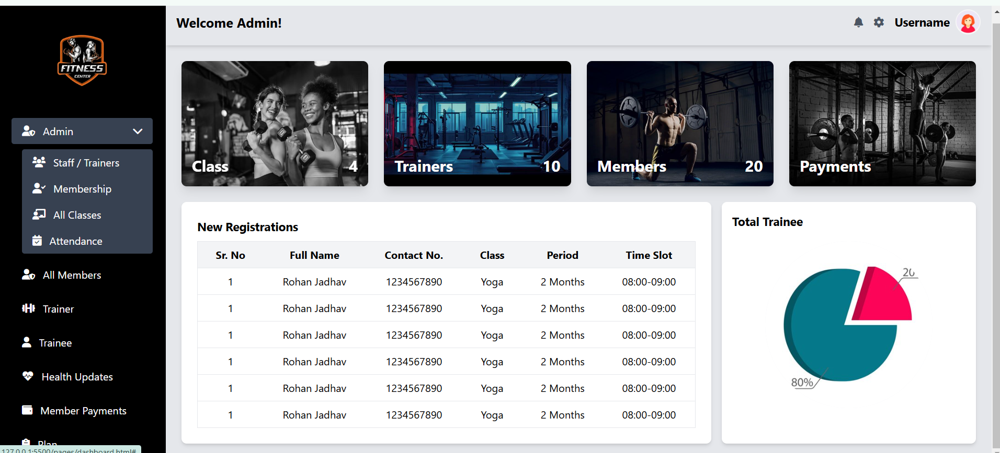
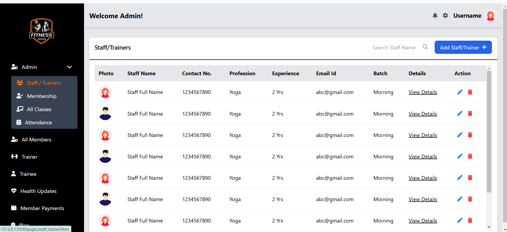

# My Awesome Website Project

This project demonstrates a cool website with an admin dashboard.

## 1. Index Page

The index page is the landing page of the website. Below is a screenshot of the index page:

## 2. Dashboard

Once logged in, users are redirected to the dashboard. Here's a screenshot of the dashboard view:

## 3. Sidebar Navigation
The Sidebar offers navigation options, including Admin, All Members, Trainer, and more. Hovering over the Admin section reveals a submenu with options to manage staff and trainers.
Admin Submenu Expanded
When hovering over the Admin option, the submenu appears, providing links to manage:
Staff / Trainers
Membership
All Classes
Attendance

## 4. Staff/Trainer Page

One of the options under the admin submenu is the **Staff / Trainer** page. This page displays a list of staff or trainers, which the admin can manage. Below is a screenshot of the **Staff / Trainer** page after clicking on the submenu:

## 5. Adding a Trainer
On the Staff / Trainer Page, click the Add Trainer button to open the form for adding new trainers.
**Add Trainer Form**
The Add Trainer Form allows you to input the necessary details for a new trainer, such as their name, email, contact information, and expertise.

## 6. View Trainer/Staff Details Page
After filling in the necessary information in the Add Trainer Form, click the Save button.
The Trainer/Staff Details Page displays the complete information of the newly added trainer or staff member, including their name, email, contact details, and expertise.

